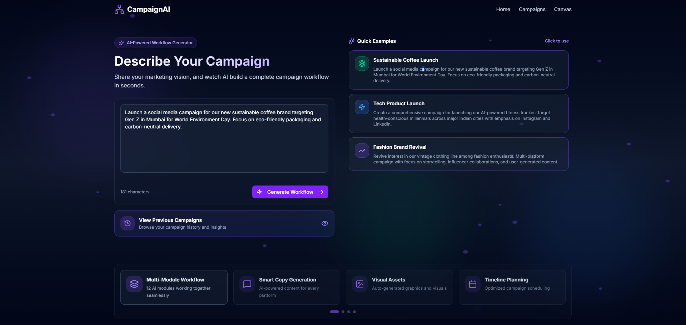

# 🚀 AI Campaign Strategist Platform


*Modern, intuitive landing page welcoming you to AI-powered campaign creation*

---

An autonomous AI-powered marketing campaign platform that transforms simple marketing briefs into fully-executable, multi-step campaign workflows. Input a single brief, get a complete campaign strategy with research, content, visuals, and execution plans.

[](https://nextjs.org/)
[](https://fastapi.tiangolo.com/)
[](https://www.python.org/)
[](https://www.typescriptlang.org/)

---

## 🎯 What It Does

Describe your marketing campaign in plain English, and our AI:
- 📊 Researches market trends and competitor strategies using live data
- 🎨 Generates stunning visual assets with AI
- ✍️ Creates compelling copy and content
- 📅 Creates smart content distribution calendars with scheduling
- 🔗 Connects specialized AI modules into an executable workflow
- ⚙️ Lets you customize every parameter with an intuitive visual editor

**Example Brief:**
> *"Launch a social media campaign for our new sustainable coffee brand targeting Gen Z in Mumbai for World Environment Day"*

**You Get:** A complete workflow with market research, audience analysis, generated visuals, interactive content calendar, and email campaigns—all ready to execute.

---

## ✨ Key Features

### 1️⃣ Natural Language Campaign Brief

*Simply describe your campaign—our AI does the heavy lifting*

Write your campaign goals in plain English. Our AI agent analyzes your brief and automatically generates an intelligent workflow with the right modules connected in the optimal sequence.

### 2️⃣ Visual Workflow Canvas with AI Agent Thinking

*Watch the AI agent think and generate your campaign strategy in real-time*

- **Interactive Node-Based Editor**: Drag, drop, and connect 12 specialized AI modules
- **AI Agent Visualization**: See the agent's thought process as it generates your strategy
- **Real-Time Execution**: Watch data flow through modules with live status updates
- **Smart Connections**: Type-safe ports ensure modules connect correctly

### 3️⃣ Powerful AI-Generated Visual Assets

*AI-generated images tailored to your brand and campaign*

Our Visual Asset Generator creates stunning, brand-aligned images using state-of-the-art AI models. Customize prompts, styles, dimensions, and brand guidelines—all within the workflow.

### 4️⃣ Smart Content Distribution Calendar

*Interactive calendar showing when and where to post your content*

The Content Distribution Scheduler creates a comprehensive posting calendar across all platforms. View the entire schedule at a glance, click on any scheduled post to see its full content, platform, optimal posting time, and engagement predictions. A complete content pipeline visualized beautifully.

### 5️⃣ Fine-Grained Module Control

*Customize every parameter with intuitive form controls*

Click any module to open its configuration panel. Adjust inputs manually or let connected modules auto-fill parameters. Real-time validation ensures everything works correctly.

---

## 🧩 The 12 AI Modules

Our platform features **12 specialized AI modules** that work together:

| Module | Purpose | Key Capability |
|--------|---------|----------------|
| 🎨 **Visual Asset Generator** | Create AI images | Generates brand-aligned visuals with custom prompts |
| 🎬 **Video Content Generator** | Produce marketing videos | Transforms scripts and images into engaging videos |
| ✍️ **Copy Content Generator** | Write marketing copy | Creates captions, emails, and ad copy |
| 👥 **Audience Intelligence Analyzer** | Research target audience | Analyzes demographics and behavior patterns |
| 📅 **Campaign Timeline Optimizer** | Optimize schedules | Creates task timelines with dependencies |
| 📱 **Content Distribution Scheduler** | Plan social posts | Schedules content across platforms |
| 📞 **Outreach Call Scheduler** | Schedule calls | Plans optimal call times |
| 🚀 **Content Distribution Executor** | Publish content | Actually posts to social media |
| 🗣️ **Voice Interaction Agent** | Make voice calls | Conducts automated conversations |
| 🔍 **Lead Discovery Engine** | Find leads | Discovers and qualifies prospects |
| 📧 **Collaboration Outreach Composer** | Write outreach emails | Personalizes messages at scale |
| 🔗 **External API Orchestrator** | Connect third-party APIs | Universal integration connector |

Each module is self-contained with defined inputs and outputs. Connect them visually to create powerful automation workflows.

---

## 🛠️ Tech Stack

**Frontend:**
- Next.js 15.5.4 (React 19) with TypeScript
- TailwindCSS 4 for styling
- React Flow (@xyflow/react) for workflow canvas
- Zustand for state management
- Radix UI components
- Supabase for authentication

**Backend:**
- FastAPI for REST API
- Google Gemini 2.0 Flash for AI agent
- Exa API for real-time market research
- Firecrawl for web scraping
- Pydantic for data validation
- Multiple AI model integrations (OpenAI, Groq)

---

## 🚀 Getting Started for Developers

### Prerequisites

- Node.js 18+ and npm
- Python 3.8+
- Git

### Required API Keys

You'll need these free/trial API keys:
- **Google Gemini API** (Required) - [Get it here](https://ai.google.dev/)
- **Exa API** (Required) - [Get it here](https://exa.ai/)
- **Supabase** (Required) - [Get it here](https://supabase.com/)
- OpenAI, Firecrawl, Groq (Optional)

---

### 📦 Installation Steps

#### 1. Clone the Repository
```bash
git clone https://github.com/saumyadesai17/Reverse_CowBoys_Final-Round_68.git
cd Reverse_CowBoys_Final-Round_68
```

#### 2. Backend Setup

```bash
# Navigate to backend
cd backend

# Create virtual environment (recommended)
python -m venv venv

# Activate virtual environment
# Windows:
venv\Scripts\activate
# Mac/Linux:
# source venv/bin/activate

# Install dependencies
pip install -r requirements.txt
```

**Create `backend/.env` file:**
```env
GEMINI_API_KEY=your_gemini_api_key_here
EXA_API_KEY=your_exa_api_key_here
FIRECRAWL_API_KEY=your_firecrawl_api_key_here (optional)
OPENAI_API_KEY=your_openai_api_key_here (optional)
GROQ_API_KEY=your_groq_api_key_here (optional)
```

```bash
# Start backend server
python run_server.py
```

✅ Backend running at `http://localhost:8000`  
📚 API docs at `http://localhost:8000/docs`

#### 3. Frontend Setup

Open a **new terminal** and run:

```bash
# Navigate to frontend (from project root)
cd frontend

# Install dependencies
npm install
```

**Create `frontend/.env.local` file:**
```env
NEXT_PUBLIC_SUPABASE_URL=your_supabase_project_url
NEXT_PUBLIC_SUPABASE_ANON_KEY=your_supabase_anon_key
NEXT_PUBLIC_API_URL=http://localhost:8000
```

```bash
# Start development server
npm run dev
```

✅ Frontend running at `http://localhost:3000`

#### 4. Access the Application

1. Open browser to **http://localhost:3000**
2. You'll see the landing page
3. Click **"Get Started"** or **"Try It Free"**
4. Sign up with email
5. You'll be redirected to the brief input page
6. Enter your campaign brief and watch the magic happen! ✨

---

### 🎮 How to Use

1. **Enter Campaign Brief**: Describe your campaign in plain English on the brief page
2. **Wait for AI Generation**: Watch the AI agent analyze and create your workflow
3. **Review Workflow**: See your custom workflow on the visual canvas
4. **Customize Modules**: Click any module to adjust its parameters
5. **Add/Remove Modules**: Drag new modules from the sidebar or delete existing ones
6. **Connect Modules**: Draw connections between module ports
7. **Execute Workflow**: Click the execute button to run your campaign
8. **View Results**: Check outputs in the right panel

---

### 📂 Project Structure

```
Reverse_CowBoys_Final-Round_68/
├── backend/                      # FastAPI Backend
│   ├── fastapi_market_agent.py   # Main API with all endpoints
│   ├── run_server.py             # Server startup
│   ├── market_analysis_agent.py  # Market research agent
│   ├── audience_intelligence_analyzer.py
│   ├── campaign_timeline_optimizer.py
│   ├── copy_content_generator.py
│   ├── image.py                  # Visual asset generation
│   ├── email_sender.py           # Email campaigns
│   └── requirements.txt          # Python dependencies
│
├── frontend/                     # Next.js Frontend
│   ├── src/
│   │   ├── app/                  # Next.js pages
│   │   │   ├── landing/          # Landing page
│   │   │   ├── auth/             # Login/Signup
│   │   │   ├── brief/            # Campaign brief input
│   │   │   └── canvas/           # Workflow editor
│   │   ├── components/
│   │   │   ├── workflow/         # Canvas components
│   │   │   │   ├── CampaignCanvas.tsx
│   │   │   │   ├── Sidebar.tsx
│   │   │   │   └── nodes/        # Node components
│   │   │   └── ui/               # UI components
│   │   └── lib/
│   │       ├── moduleDefinitions.ts  # Module specs
│   │       ├── workflowGenerator.ts  # AI workflow generation
│   │       └── workflowExecution.ts  # Execution logic
│   └── package.json
│
└── README.md                     # This file
```

---

## 🔌 API Endpoints

Once the backend is running, visit `http://localhost:8000/docs` for interactive API documentation.

**Key Endpoints:**

- `POST /campaign/plan` - Generate comprehensive campaign from structured input
- `POST /campaign/quick` - Generate campaign from brief text
- `POST /execute/visual_asset_generator` - Execute visual asset generation
- `POST /execute/copy_content_generator` - Execute content generation
- `POST /execute/campaign_timeline_optimizer` - Execute timeline optimization
- `POST /execute/audience_intelligence_analyzer` - Execute audience analysis
- And more for each module...

---

## 🐛 Troubleshooting

**Backend won't start:**
- Ensure Python 3.8+ is installed: `python --version`
- Check all required API keys are in `.env`
- Verify virtual environment is activated

**Frontend won't start:**
- Ensure Node.js 18+ is installed: `node --version`
- Delete `node_modules` and `package-lock.json`, then run `npm install` again
- Check `.env.local` has correct Supabase credentials

**API calls failing:**
- Ensure backend is running on port 8000
- Check `NEXT_PUBLIC_API_URL` in frontend `.env.local`
- Verify CORS settings if using different ports

**Authentication issues:**
- Verify Supabase project is set up correctly
- Check Supabase URL and anon key in `.env.local`
- Ensure email authentication is enabled in Supabase dashboard

---

## 👥 Team

**Reverse Cowboys** - A team of 4 passionate developers

---